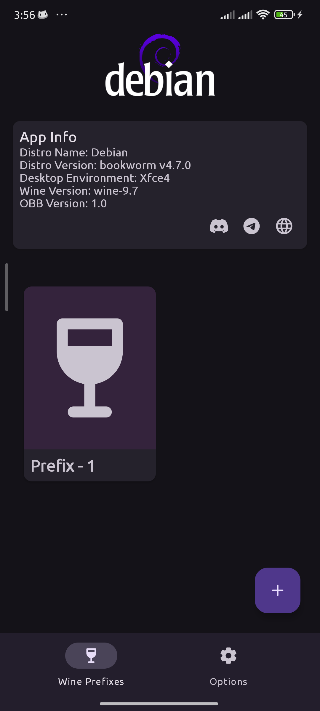
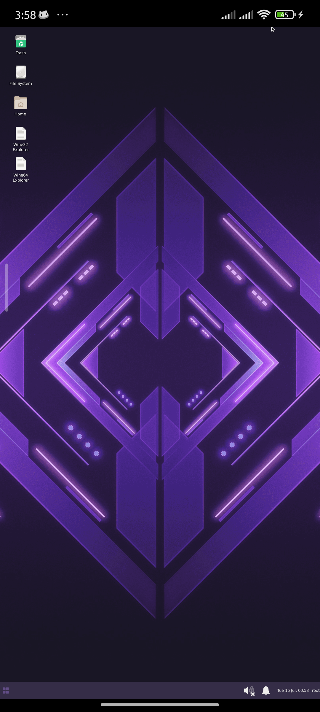

# Boxvidra

Boxvidra is an Android application that leverages Proot to run Debian, XFCE4, Wine, Box86, and Box64 environments directly on your Android device. It enables the execution of Linux applications and Windows binaries, expanding the capabilities of Android into a versatile development and testing platform.

 

## Features

- **Linux on Android:** Launch Debian with XFCE4 desktop environment on your Android device.
- **Windows Applications:** Run Windows applications through Wine, with support for Box86 and Box64 emulation.
- **Proot Integration:** Efficiently manage chroot-based Linux environments directly from your device.
- **Customizable:** Configure environment variables and settings seamlessly within the app.

## Third-Party Acknowledgments

Boxvidra utilizes the following third-party tools and libraries:

- **Proot:** For chroot-based Linux environment setup.
- **Wine:** For running Windows applications on non-Windows systems.
- **Box86 and Box64:** x86 and ARM64 emulator for running Linux x86 applications on ARM.
- **Adreno Turnip:** Graphics driver for Qualcomm Adreno GPUs.

## Installation

To use Boxvidra, follow these steps:

1. **Download APK:** Get the APK from the [releases page](https://github.com/Boxvidra/Boxvidra-Android/releases).
2. **Download OBB File:** Download the required OBB file from [here](https://boxvidra.blackstorm.cc).
3. **Install APK:** Install the downloaded APK on your Android device.
4. **Place OBB File:** Place the downloaded OBB file in the appropriate directory on your device.
5. **Permissions:** Grant necessary permissions for the app to function properly.

## Usage

1. Open the app and create a prefix.
2. Customize settings and environment variables as needed.
3. Start your chosen environment and enjoy Linux and Windows applications on your Android device.

## Contributing

Contributions to Boxvidra are welcome! Feel free to submit issues and pull requests to help improve the app.

## License

This project is licensed under the MIT License - see the [LICENSE](LICENSE) file for details.
